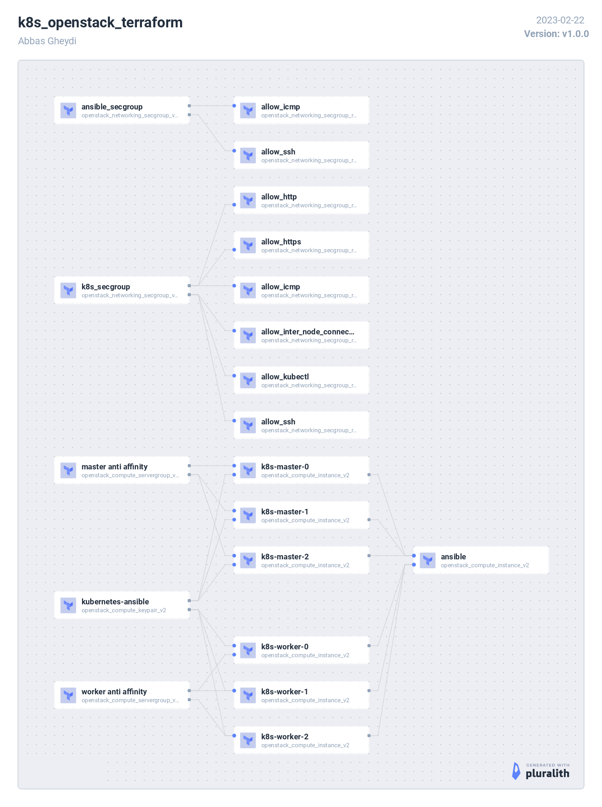

## k8s_openstack_terraform

## About The Project:

Provision a Production Grade "Kubernetes" cluster with [Terraform](https://www.terraform.io/) on OpenStack.

It deploys one "ansible" vm and install and configure [kubespray](https://github.com/kubernetes-sigs/kubespray) on it

Then create the desired number of master and worker nodes.

And automatically start the kubernetes deployment process.

